## BinBox 
#### Project #1 CMPE 281 SEC 48 | Asish Raju Vachavaya - 016943433

| Website      | Demo |
| ----------- | ----------- |
| [https://binbox-app.asish.site/](https://binbox-app.asish.site/)      | [https://youtu.be/fRn0qmUeV80](https://youtu.be/fRn0qmUeV80)       |

## Introduction

BinBox is a Dropbox alternative that leverages S3 file storage service
to provide users with a secure environment to store and access files
across the internet. It supports operations such as uploading,
downloading, updating, and deleting files and also provides an admin
panel for a master view of all users. BinBox is made on top of AWS
services, ensuring high reliability and availability with auto-scaling
in mind based on the concurrent usage of the app. The files uploaded on
BinBox are made available to users globally with the help of edge
location via AWS CloudFront; this makes accessing files faster,
enhancing user experience.

## BinBox Architecture

## AWS Infrastructure Setup

### AWS Cognito

AWS provides user management and authentication services. It allows
developers to easily add secure user sign-up, sign-in, and access
control to web and mobile applications. BinBox uses AWS SDK to
authenticate users from its client side using custom login/signup pages.
We define a user pool with appropriate user attributes required to
consider a user account.

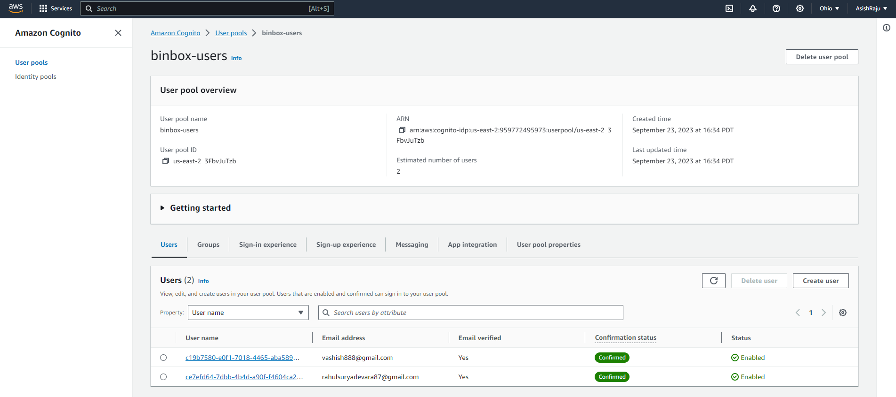

### AWS DynamoDB

A No-SQL database offered by AWS, BinBox uses DynamoDB to maintain the
user's file submissions list. Create a BinBox table and set read and
write autoscaling to provisioned capacity.

Enable global tables for replicating DynamoDB table across the different
regions; here, the region of choice is ap-south-1 (Mumbai) while the
primary one is in us-east-2 (Ohio). This enables fault tolerance during
the unavailability of one region and can also be applied to failover
strategies.

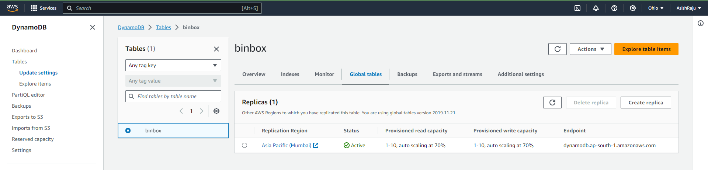

Each entry into the table has a pp-key (partition key) randomly
generated during insertion and used as a primary key to run queries on
the table.

### AWS S3

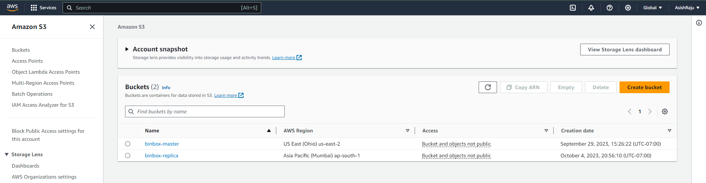

S3 is an
object storage service provided by S3; this is where the actual files
are stored and uploaded by the user. To increase availability and
durability, the S3 primary bucket is replicated to cross region
ap-south-1 (Mumbai), and the replication is set to happen on each file
and folder.

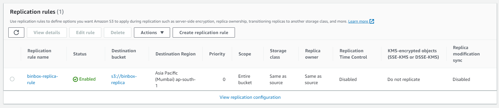

Enabling transfer acceleration reduces the upload speed by a significant
fold, as the continent is uploaded to the nearest edge server. Then, the
whole content travels to the origin of the S3 bucket.

Enabling a lifecycle policy can help
maintain objects\' lifecycle and transfer objects through different S3
access tiers. The current lifecycle policy is to transfer current
objects to S3-IA after 75 days of object creation and then move to
Glacier Instant Retrieval after 365 days; for the non-current versions,
the latest three versions of the objects are retained, and others are
deleted. The same lifecycle policy applies to the replication layer in
the ap-south-1 (Mumbai) S3 bucket.

### AWS Lambda

AWS Lambda is a serverless computing offering that allows users to run
their code without worrying about the underlying setup of infrastructure
required to do so. BinBox uses lambda to call backend APIs required to
access the DynamoDB items and S3 file uploading.

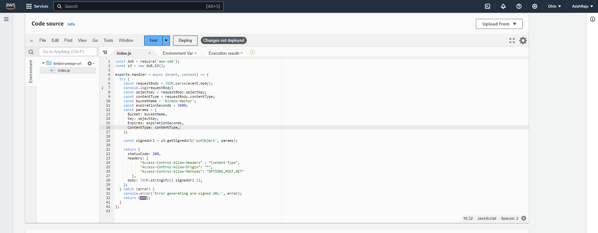

Defined two lambda functions here;
"binbox-presign-url" lambda to obtain a pre-sign URL required to upload
a file to S3 and "binbox-db-ops" to handle all the dynamoDb-related
functions required to make the update, read, create operation on the
table.

### API Gateway!

API gateway offering provided by AWS to connect backend services such as
AWS lambda, EC2, and other database services to expose the services to a
frontend client. Here, API Gateways are attached to the lambda function
to provide client-facing endpoints required by the frontend to upload or
make database queries.

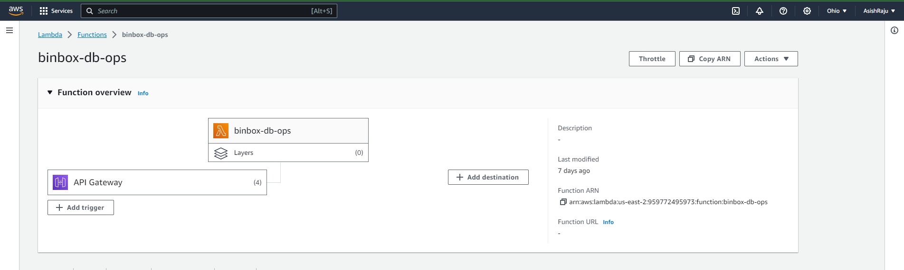

This API acts as a trigger for AWS Lambda
functions to invoke and process data.

### AWS CloudFront

Cloudfront is a content delivery network
service offered by AWS. It is intended to increase the performance,
scalability, and reliability of your online content, apps, and APIs by
caching and delivering them from a worldwide network of edge data
centers. CloudFront is frequently used to expedite static and dynamic
content delivery, minimize latency, and enhance overall user experience.
CloudFront here is enabled for lambda functions and S3, making lambda
functions run at edge with node.js runtime.

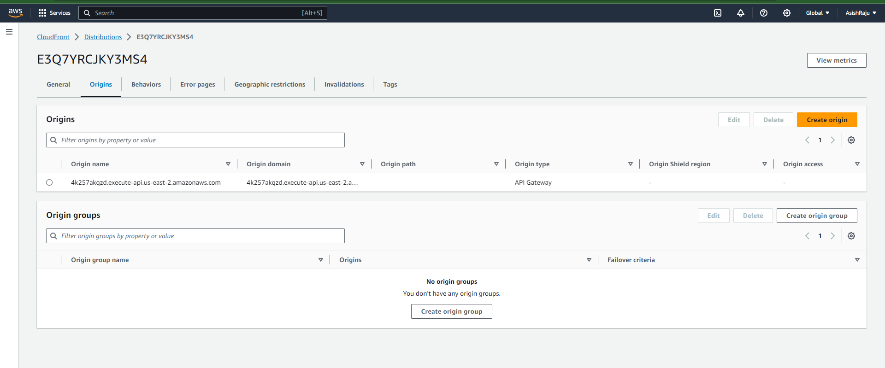

### AWS EC2

A compute service offered by AWS. It helps organizations and developers
to effortlessly install and operate virtual servers in the cloud, known
as instances. EC2 instances may be configured to handle a wide range of
workloads, from web apps and database hosting to machine learning models
and

high-performance computing activities. BinBox EC2 is set via an
autoscale group, for which we initiate a launch template.

This launch template is assigned to an autoscale group that works with a
combination of Cloudwatch to measure CPU usage, launch an instance in
the same region, and notify the user via an SNS topic attached to the
autoscale group.

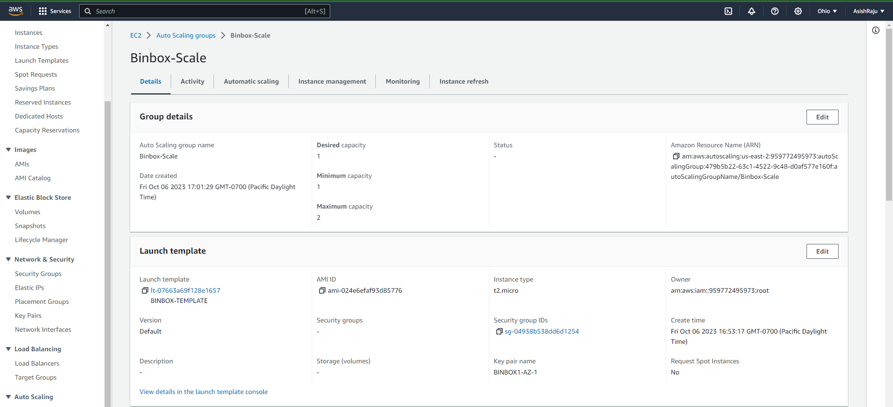

The same is carried forward to the ap-south-1 (Mumbai) with the
autoscaling group and launch instance

Configure SNS topic so the author or administrator gets notified about
the activity on the auto-scaling group.

**Application** **Load** **Balancer**

An Application Load Balancer (ALB) is a fully managed load balancing
service provided by Amazon Web Services (AWS) as part of its Elastic
Load Balancing (ELB) offering. ALB is designed to distribute incoming
application traffic across multiple targets, such as Amazon EC2
instances, containers, Lambda functions, and IP addresses, based on the
content of the requests. It operates at the OSI model\'s application
layer (Layer 7), making it well-suited for handling modern web
applications. Here, the application load balancer is attached to the
auto-scaling group, which distributes load between the running instances
in the region.

The same is replicated to the us-east-2 (Ohio) region where an
application load balancer sits in front of the autoscaling group of the
ec2 instances in the Ohio region.

### Route 53

Route 53 is an offered domain name service provider; Route 53 enables
you to register domain names, route incoming traffic to AWS resources,
and perform domain management tasks like health checking, failover
routing, and traffic policy configuration. Creating a Hosted Zone
enables the author to manage his domain name from the given name
servers. BinBox uses a failover routing policy to shift between
available zones of computing. For the following, we enable health checks
for both regions.

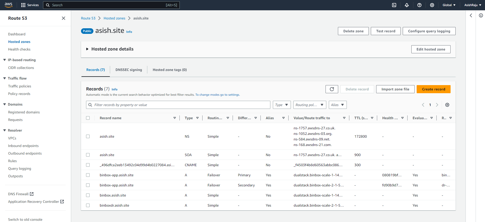
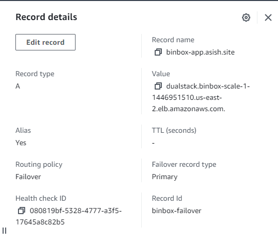
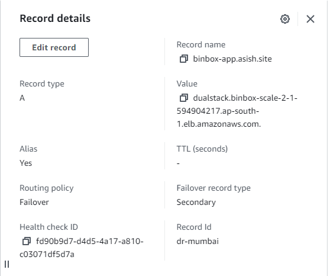

When any one of the regions heals, checks
fail the Route53 failover. Redirects the user to the r-2 computing zone,
ensuring proper website availability.

## Application Screenshots!

### Login Page
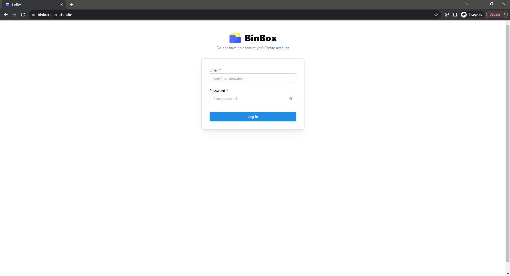

### Sign Up Page

### OTP Verify Page

### User Home Page

### Upload Screen

### Update File Screen
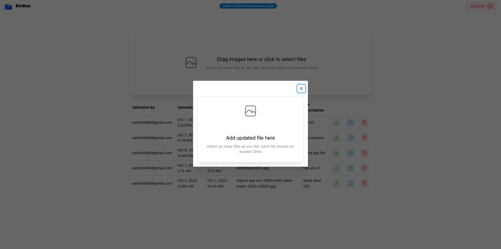

### Admin Panel
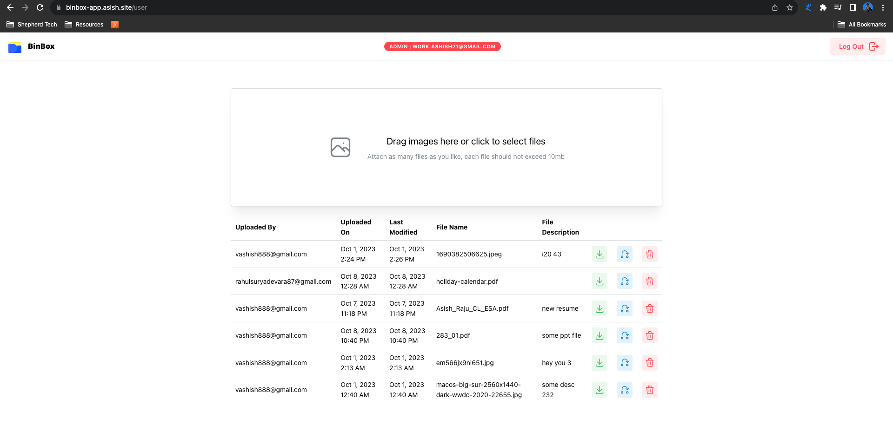